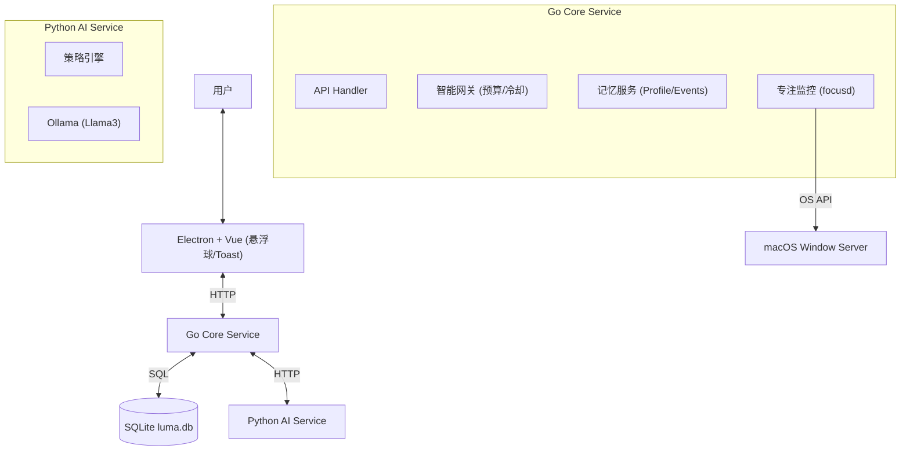

# Luma (Local Silent Companion Agent)

Luma 是一个本地优先（Local-first）的桌面陪伴 Agent，旨在通过非侵入式的方式帮助用户保持专注与健康。它具备长期记忆能力，能够根据用户的行为习惯和偏好，智能地决定何时介入、如何建议。

## 核心特性

*   **静默陪伴**: 默认不打扰，仅在关键时刻（如长时间久坐、频繁分心、深夜加班）给出轻量建议。
*   **长期记忆**: 基于 SQLite 的本地记忆系统，能记住你的工作习惯、偏好（Profile）以及近期关键事件（Memory Events）。
*   **智能网关**: 内置“介入预算”与“冷却机制”，防止 AI 过度打扰。
*   **反馈闭环**: 支持对建议进行 👍/👎 反馈，系统会自动调整后续策略并更新用户画像。
*   **隐私安全**: 所有数据（屏幕活动、记忆、日志）均存储在本地，推理默认使用本地 Ollama 模型。

## 架构概览



## 快速开始

### 前置依赖
*   **Node.js** (v18+)
*   **Go** (v1.21+)
*   **Python** (v3.10+)
*   **Ollama** (需安装并拉取模型，如 `ollama pull llama3`)

### 启动服务

1.  **启动所有服务 (开发模式)**
    ```bash
    # 推荐使用脚本一键启动
    ./scripts/dev.sh
    ```
    或者分别启动：
    *   **Core**: `cd services/core-go && go run main.go` (Port: 8081)
    *   **AI**: `cd services/ai-py && uvicorn main:app --port 8788`
    *   **UI**: `cd apps/desktop && npm run dev`

2.  **使用说明**
    *   启动后，桌面右下角会出现一个悬浮球。
    *   **悬浮球颜色**: 灰色(静默) / 蓝色(轻度) / 橙色(积极)。
    *   **点击悬浮球**: 展开主面板，可进行对话或查看状态。
    *   **AI 建议**: 当 AI 决定介入时，悬浮球下方会弹出气泡提示，可直接反馈。

## 关键模块说明

### 1. 核心服务 (Go)
*   **Gateway**: 实现了 Stateful 的拦截逻辑。
    *   *冷却时间*: 默认 5 分钟内不重复打扰。
    *   *预算控制*: 每次介入消耗预算（如 `TASK_BREAKDOWN` 消耗 3 点），预算随时间恢复。
*   **Memory**: 管理 `profiles` (用户画像) 和 `memory_events` (事件流)。
    *   自动根据用户反馈 (Feedback) 更新画像。
    *   在每次决策时注入最近 5 条关键记忆。

### 2. AI 服务 (Python)
*   基于 FastAPI + Ollama。
*   **Prompt 策略**: 动态注入 `User Profile` 和 `Recent Memories`，使 LLM 具备上下文感知能力。
*   **结构化输出**: 强制输出 JSON 格式，包含 `action_type`, `confidence`, `risk_level` 等字段。

### 3. 桌面端 (Electron + Vue)
*   **FloatingBall**: 常驻桌面的轻量级入口，支持拖拽。
*   **SuggestionToast**: 低打扰的建议展示组件。
*   **FocusMonitor**: 实时采集前台应用与窗口标题（仅本地使用）。

## API 示例

### POST /v1/decision
请求 AI 进行决策：
```json
{
  "context": {
    "user_text": "我有点累了",
    "mode": "ACTIVE",
    "timestamp": 1710000000000,
    "signals": {
      "focus_app": "VS Code",
      "focus_minutes": "45"
    }
  }
}
```

响应 (包含记忆注入与网关决策)：
```json
{
  "action": {
    "action_type": "REST_REMINDER",
    "message": "你已经连续工作45分钟了，根据你的习惯，建议休息一下。",
    "confidence": 0.85
  },
  "gateway_decision": {
    "decision": "ALLOW",
    "reason": "allow"
  },
  "context": {
    "profile_summary": "- work_style: 喜欢番茄工作法",
    "memory_summary": "- User provided feedback LIKE for action REST_REMINDER"
  }
}
```

## 开发指南

*   **数据库**: SQLite 文件位于 `data/luma.db`。
*   **日志**: AI 服务日志位于 `services/ai-py/logs/`。
*   **配置**: 通过 UI 设置面板调整介入频率与安静时段。

## License
MIT
